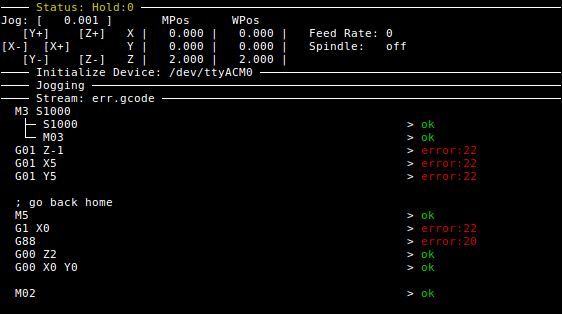

# grbl-stream

Command-line GRBL streaming script

## Focus

The primary focus for `grbl-stream` is for it to be a **robust** and **reliable**
link between your CAM software to your CNC hardware.

This project started with my CNC machine occasionally returning errors on gcodes
unpredictably, then continuing with the next g-code... so I thought... "can't
the software figure this out for me!?".

With simple streamers, no, it can't, but I think I can do it... thus `pygcode`
and `grbl-stream` was born. (also: I was unemployed, bored, and sick of playing
games, so that helped)

## Limitations

- a bit buggy at the moment (currently in pre-alpha), which is directly contrary to the primary vision for this streamer.
- won't work on Windows as is (`TODO`: there's a `curses` port for _MS DOS emulation_ (or whatever it's evolved into) called `UniCurses` which may work without much effort)

## TODO (before release)

I'm not comfortable releasing this on PyPi just yet (although that's the intention later).

This is because although I'm happy with the way it's streaming, it's `curses`
implementation is not _robust_ or _reliable_ which directly contradicts the
intent of this script (eg: resizing it can crash the script, or just mess with
rendering)

Also, `grblstream` as a python library should be able to be imported into other's
projects so they may make their own streamers with their own focus.
It is not mature enough yet to work effectively that way.

* re-build `curses` implementation to be robust
* allow to be run in non-curses mode (perfect for debugging)... (treat `curses`
  as more of a UI abstraction when re-designing implementation)
* `import grblstream` example as simple streamer
* add footer with available interaction options (key bindings)
* more graceful common error-handling (eg: GRBL device not found)
* tests

# Install

Not deployed to PyPi yet, so clone (or download) this repository, and run the
script directly form the `./scripts/` folder.

    $ git clone git@github.com:fragmuffin/grbl-stream.git
    $ cd grbl-stream/scripts
    $ ./grbl-stream ~/your_file.gcode

## Pre-requisites

Python (and pip)

    $ sudo apt install python python-pip

You'll also need a few python libraries before `grbl-stream` will work:

    $ pip install argparse pyserial six "pygcode>=0.1.2"

# Usage

## Jogging

It starts off in a _jogging_ state with keys:

    ; Jogging Keys                                                                
    ;    - Arrow Keys: X/Y axes                                                   
    ;    - PgUp/PgDn: Z axis                                                      
    ;    - []: increase/decrease jog distance                                     
    ;    - Space: zero work offsets (all axes)                                    
    ;    - x,y,z: zero individual axis                                            
    ;    - Enter: start streaming gcode                                           

Machine's mode is changed to incremental `G91` if jogging is requested, then reverted back to the initial mode when finished.

## Streaming

When user presses `[enter]` script switches state to streaming gcode over serial

in both _jogging_ and _streaming_ states, gcode on screen indicates gcode progress with:

    G00 Z2       > ok       line sent, GRBL responded with 'ok'
    (comment)               displayed, but no action taken
    G00 X10      >          line sent, no response received (yet)
    G00 Y-10                line not sent yet

script continues streaming / checking status until:

- all lines have been sent
- all responses have been received from GRBL
- finally: machine's state is `Idle` (ensures CNC machine has completed tool path)

### Error Handling

If an error is returned in response to a streamed line, the `!` halt command is
immediately sent.

TODO: at the time of writing this, the script is unrecoverable, it just stops
mid stream in the halted state (press _ctrl+C_ to exit)

## Command Line

running `grbl-stream --help` displays the help text...

    usage: grbl-stream [-h] [--settings SETTINGS_FILE] [--version] [--keep-open]
                       [--nojog] [--split-gcodes] [-d SERIAL_DEVICE]
                       [-b SERIAL_BAUDRATE] [--logfile LOG_FILE]
                       [infile]

    GRBL gcode streamer for CNC machine. Assist jogging to position, then stream
    gcode via serial.

    positional arguments:
      infile                gcode file to stream, to use stdin specify as '-'
                            (default: -). WARNING: If stdin (-) is used,
                            interactive jogging is disabled

    optional arguments:
      -h, --help            show this help message and exit
      --settings SETTINGS_FILE, -s SETTINGS_FILE
                            settings json file (default: /home/nymphii/.grbl-
                            stream.json)
      --version, -v         display grbl-stream version and exit

    Streaming Actions:
      --keep-open, -o       if set, window won't close when job is done
      --nojog               bypass jogging state; jump straight into streaming
                            (note: this is always set if input is stdin)
      --split-gcodes        multiple gcodes per line will be split and streamed in
                            order of execution

    Serial Connectivity:
      -d SERIAL_DEVICE, --device SERIAL_DEVICE
                            serial device GRBL is connected to, can use direct
                            device name (eg: /dev/ttyACM0) or the Arduino's serial
                            number (eg: 55639303235351C071B0)
      -b SERIAL_BAUDRATE, --baudrate SERIAL_BAUDRATE
                            serial baud rate

    Debug Parameters:
      --logfile LOG_FILE    if given, data read from, and written to serial port
                            is logged here (note: \r and \n characters are escaped
                            for debugging purposes)

# Running on remote system (eg: Raspberry Pi)

GRBL streaming will only be successful while the streaming process is allowed to
remain active (obviously, a program stops when the OS kills it).

When running on a remote system (via something like
`ssh` or `telnet`) you can keep the remote process alive by using
`tmux` or `screen`.

Starting streaming with `tmux` or `screen` will protect the GRBL stream from
issues like power-failure on your local machine, or a simple network failure.

(this is also true for any remote process... so it's generally good practice)

**`screen`**

    # on your local machine
    $ ssh pi@192.168.1.123 # or whatever

    # on machine connected to GRBL programmed device (say a Raspberry Pi)
    $ screen -Rx || screen -l
    # opens a screen session (or joins to an existing one)
    $ grbl-stream file.gode

**`tmux`**

    # on your local machine
    $ ssh pi@192.168.1.123 # or whatever

    # on machine connected to GRBL programmed device (say a Raspberry Pi)
    $ tmux attach || tmux
    # opens a tmux session (or attaches to an existing one)
    $ grbl-stream file.gode
